# Fraut WorkPlace App

A modern Kotlin Multiplatform app for Autistic Adults.

This repository is a showcase of the app's UI and features.

## 📱 Screenshots

### 🤖 Android Phones

  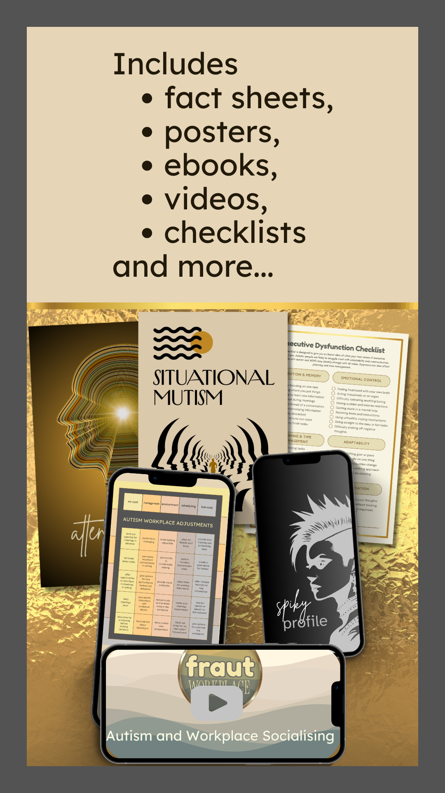
  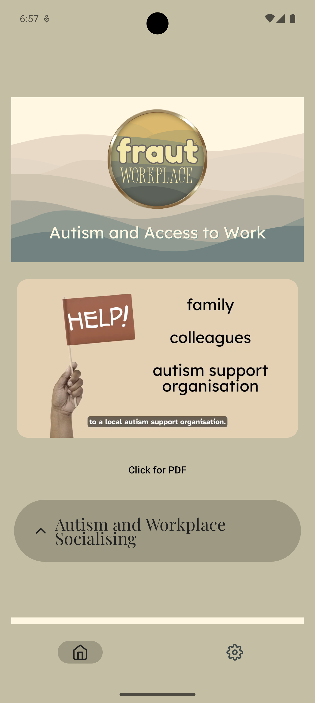

### 📱 Android Tablets

  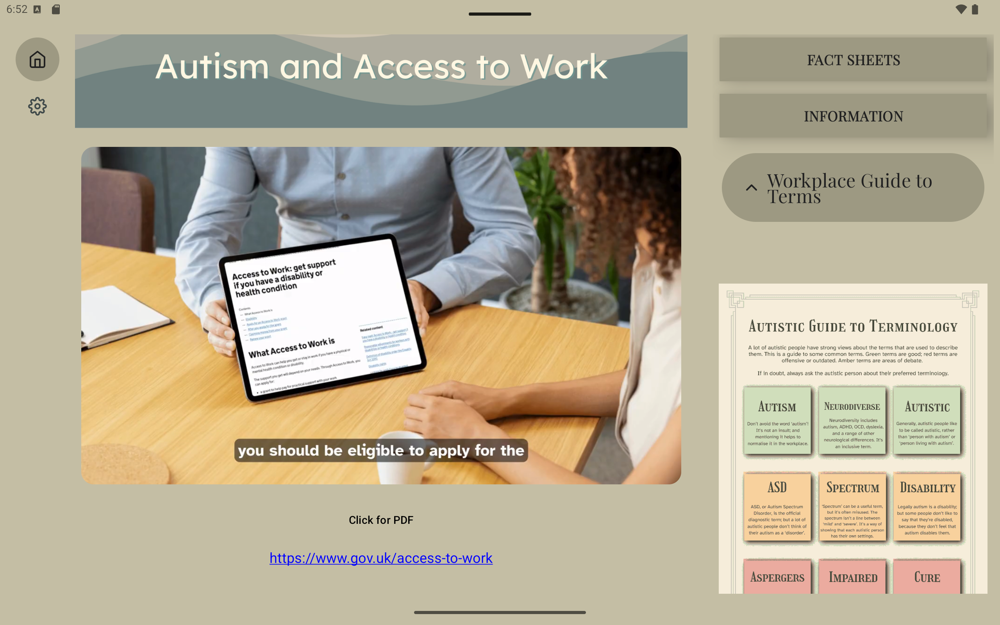
  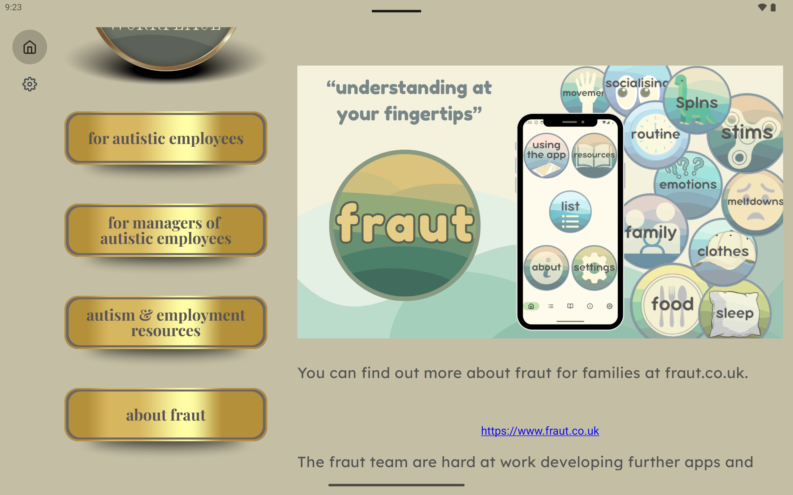
  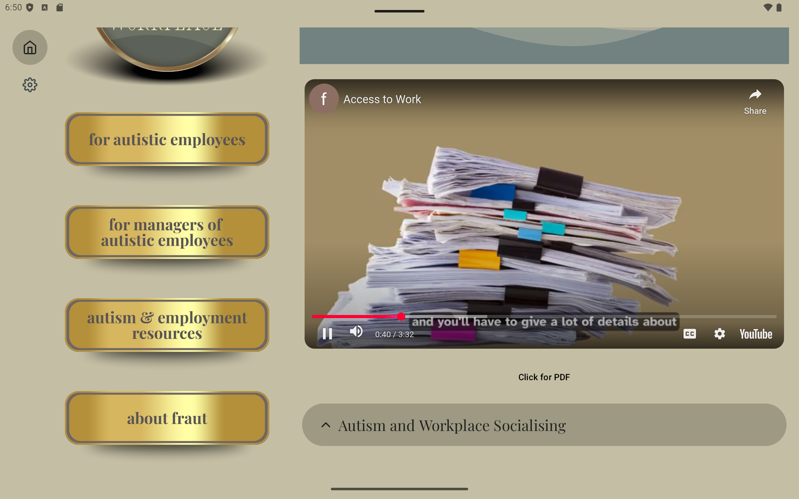

### 🍏 iPhone / iPad

  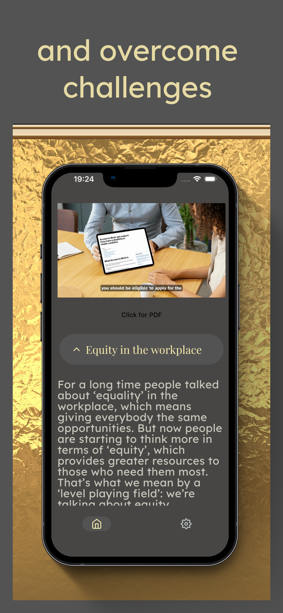
  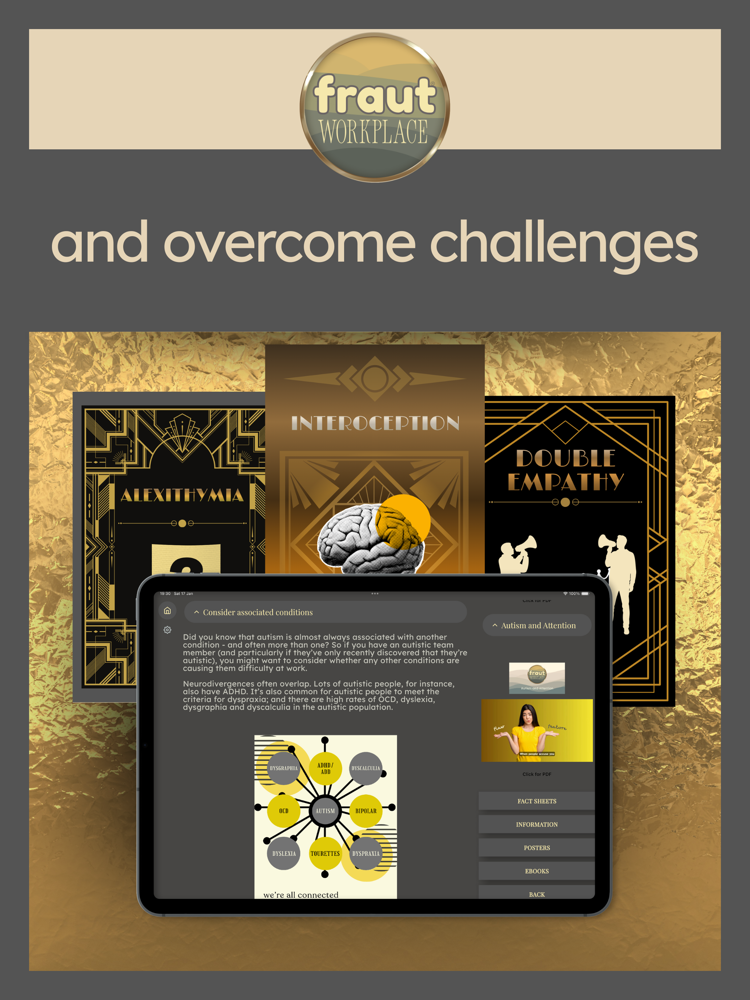

### 💻🍏🐧 Desktop (Mac / Windows)

  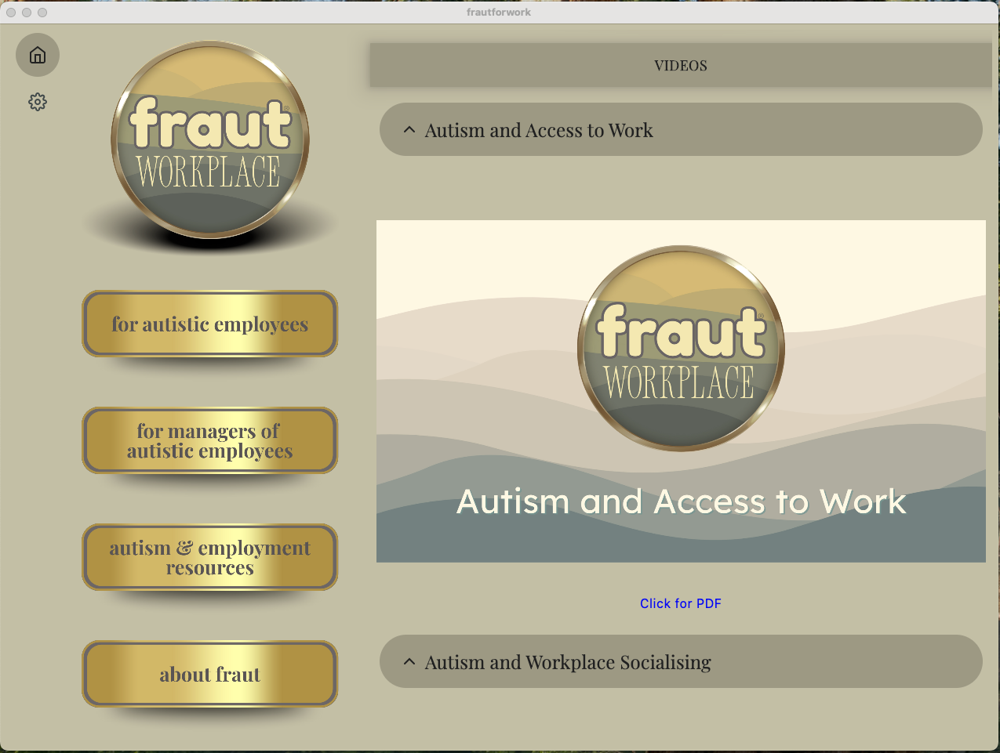
  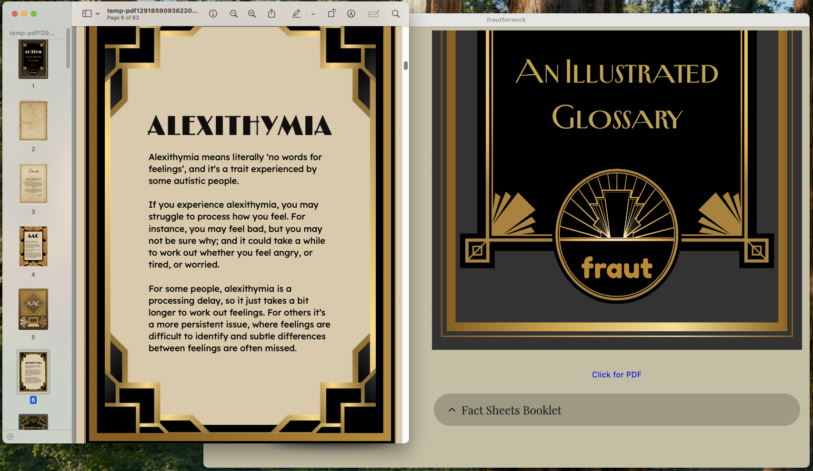
  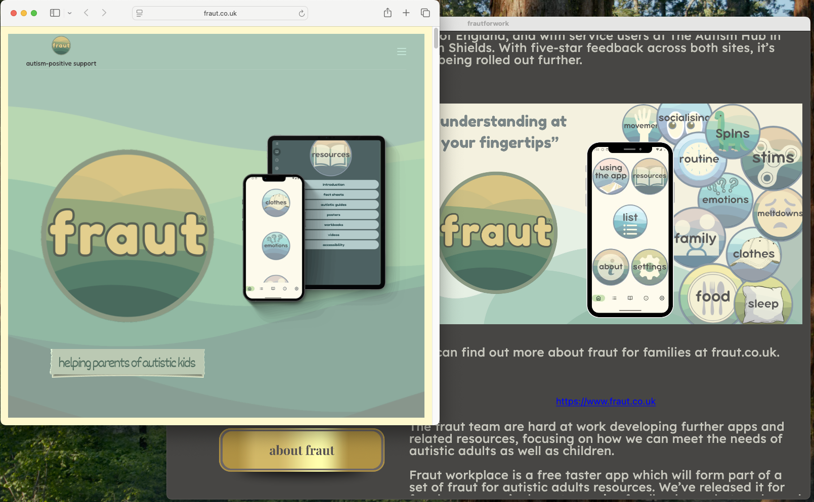

  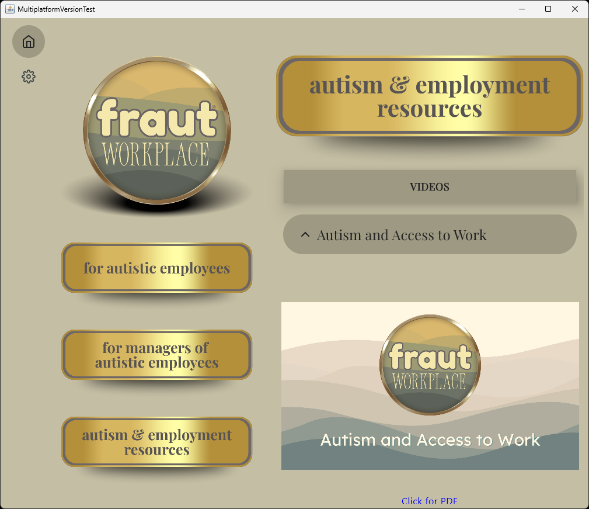
  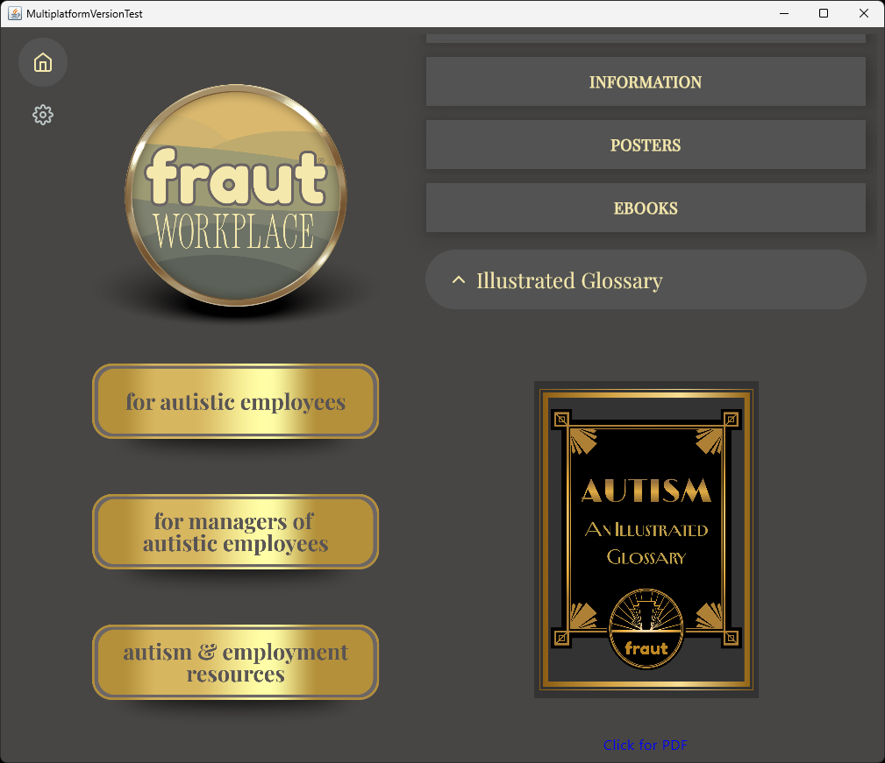

## 📝 About

This is a commercial application.  
**Source code is private and not included.**  
This repository is purely for promotional and informational purposes.

Learn more at:  
https://www.fraut.co.uk

### 📲 App Availability

**Android**  
[Google Play Store](https://play.google.com/store/apps/details?id=com.onmed.frautforwork&utm_source=emea_Med)

**iOS**  
[Apple App Store](https://apps.apple.com/gb/app/frautforwork/id6758209736)

**Windows / Mac / Linux**  
[Download from itch.io](https://tonymoham.itch.io/fraut-workplace)